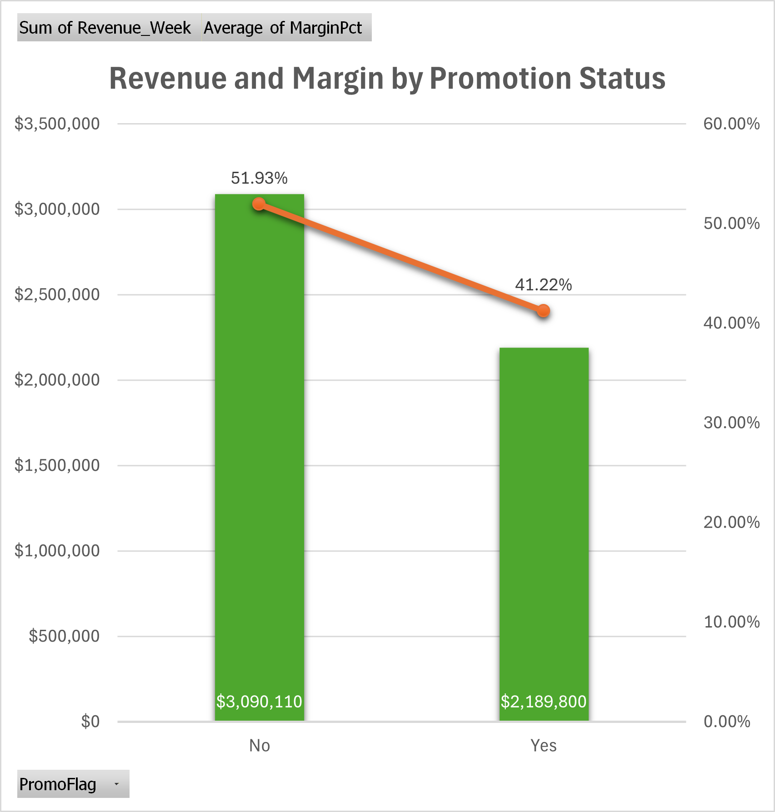
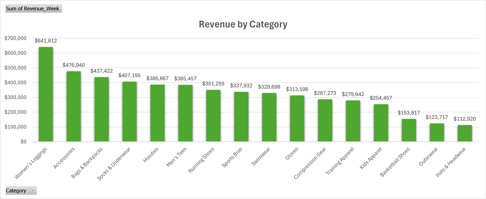
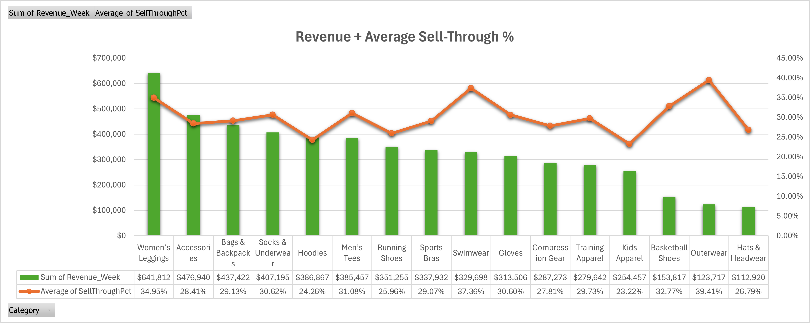
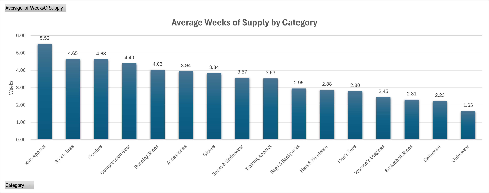
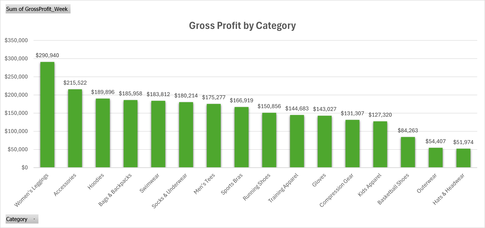
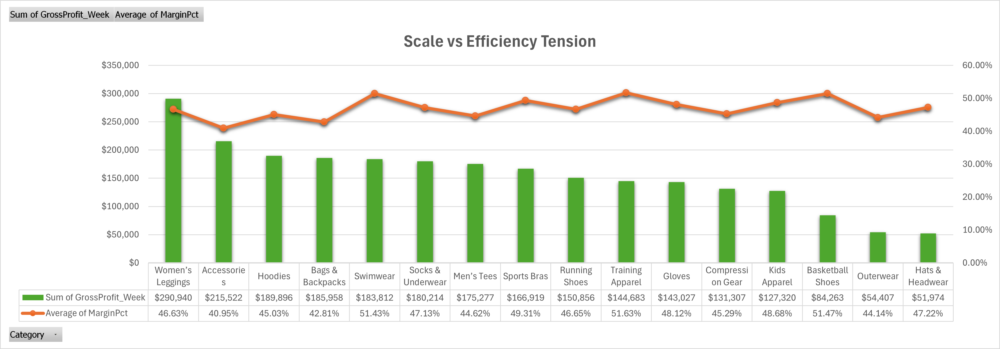

# Retail Weekly Performance Analysis

This repository contains a weekly retail analytics project built in Excel. The dataset includes product, pricing, promotion, inventory, and profitability metrics. The analysis is organized into four sheets, each answering a specific business question using pivot tables, charts, and KPI interpretation.

---

## Dataset Overview

**Columns included:**  
SKU, Category, Subcategory, Season, LaunchYear, LifecycleStage, OriginalPrice, CurrentPrice, MarkdownPct, PromoFlag, PromoType, PriceChangeDate, UnitsSold_Week, Revenue_Week, Cost, MarginPct, InventoryOnHand, WeeksOfSupply, SellThroughPct, Channel, Region, GrossProfit_Week.

**Tools used:**  
Excel (data cleaning, pivots, charts)  
Artificial Intelligence (synthetic dataset generation)

**Data preparation steps:**  
- Removed duplicates  
- Cleaned and standardized text and currency fields  
- Validated numeric fields  
- Ensured consistent category naming  
- Added calculated field (GrossProfit_Week)

---

## 1. Promotion Performance

**Business question:**  
Do promotions meaningfully improve revenue or inventory efficiency relative to full‑price products?

### Key Findings
- Full‑price items generate higher revenue and higher margin.  
- Promotions reduce margin by ~10.7 percentage points.  
- Sell‑through and weeks of supply show minimal improvement under promotions.  
- Promotions lower profitability without materially improving sales efficiency.

### Visual  

---

## 2. Category Performance & Inventory Efficiency

**Business question:**  
Which categories drive profitable growth, and which show signs of inventory risk or underperformance?

### Key Findings
- Women’s Leggings is the strongest balanced performer across revenue, sell‑through, and inventory efficiency.  
- Outerwear and Swimwear show strong velocity and low weeks of supply, suggesting under‑allocation.  
- Kids Apparel shows high weeks of supply and below‑average sell‑through, indicating inventory risk.  
- Accessories and Hoodies generate strong revenue but move slower than top performers.  
- Inventory efficiency varies meaningfully across categories.

### Visuals  
  
  

---

## 3. Profit Contribution & Efficiency

**Business question:**  
Which categories contribute the most gross profit, and how efficiently is that profit generated?

### Key Findings
- Women’s Leggings is the largest profit contributor while maintaining margin near the company average.  
- Accessories ranks second in profit but operates below average margin.  
- Swimwear, Training Apparel, and Basketball Shoes show the highest margins (~51%).  
- Margin variation significantly impacts profit contribution across categories.

### Visuals  
  

---

## 4. Strategic Recommendations

**Business question:**  
Where should the business invest, optimize pricing, or reduce inventory exposure?

### Recommendations

**Invest / Scale**  
- Expand investment in Women’s Leggings.  
- Consider scaling Swimwear and Training Apparel.

**Margin Optimization**  
- Improve pricing or cost efficiency in Accessories.

**Inventory Risk**  
- Reduce exposure in Kids Apparel due to slow demand and high weeks of supply.

**Maintain Steady Categories**  
- Maintain current strategy for Socks & Underwear and Men’s Tees.

---

## What This Project Demonstrates

- Ability to clean, structure, and validate a retail dataset in Excel.  
- Use of pivot tables, calculated fields, and KPI logic to answer business questions.  
- Skill in interpreting retail metrics such as margin, sell‑through, weeks of supply, and profit contribution.  
- Clear communication of insights through charts, summaries, and structured recommendations.  
- Professional organization of an analytics project in a GitHub‑ready format.

---

## Future Improvements

- Add a Power BI dashboard version of the analysis.  
- Expand the dataset to include multiple weeks for trend analysis.  
- Add forecasting models for demand, revenue, or inventory needs.  
- Include SQL or Python versions of the analysis for cross‑tool comparison.  
- Add automated data quality checks or Excel macros for repeatability.

---

## Full Excel File

For an in‑depth look at the dataset, pivots, and calculations, download the full Excel file:

**[retail_performance_project.xlsx](data/retail_performance_project.xlsx)**
